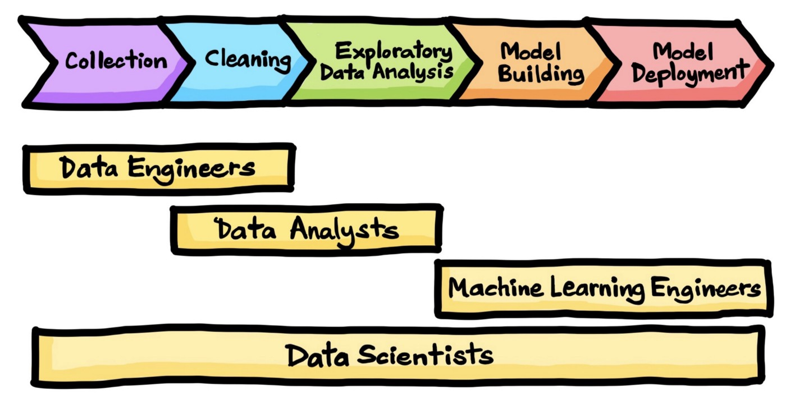
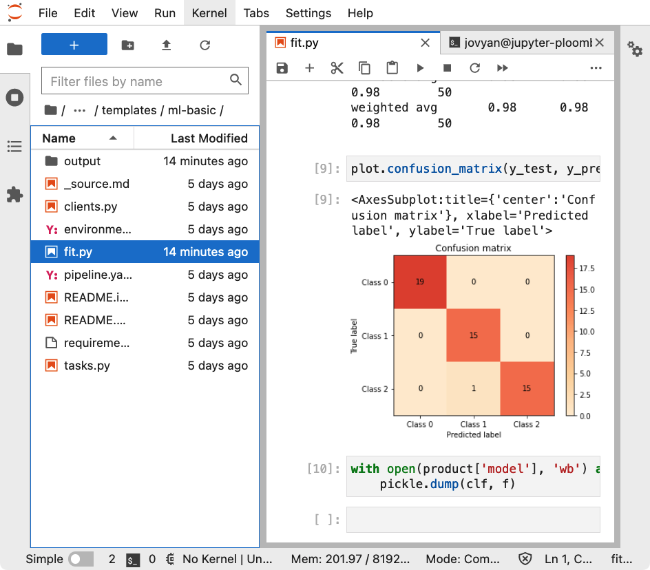
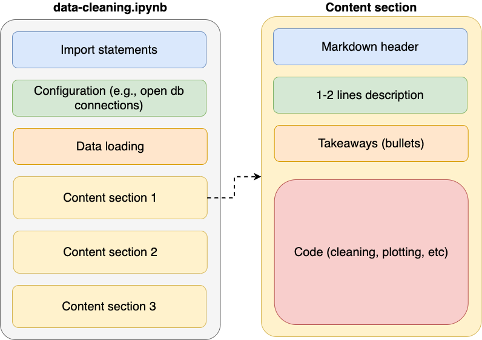
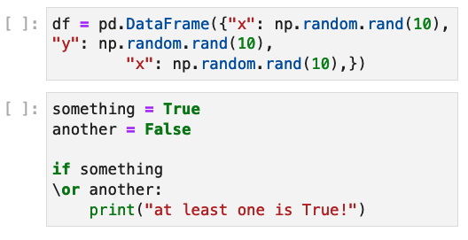
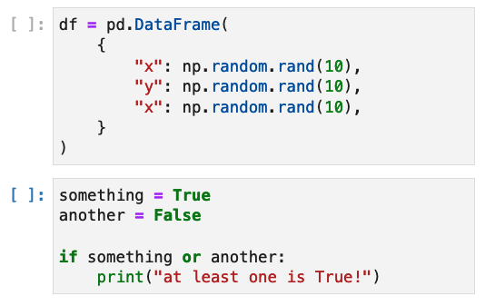
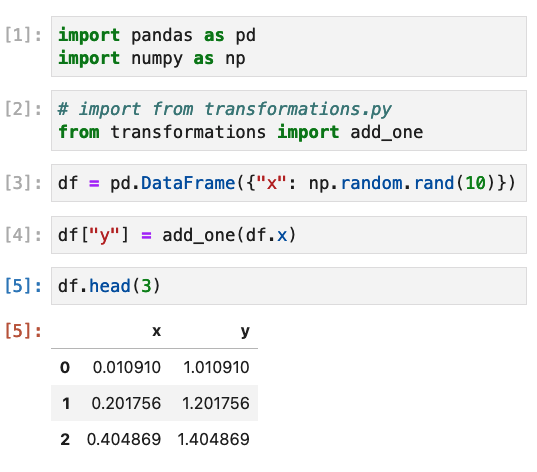
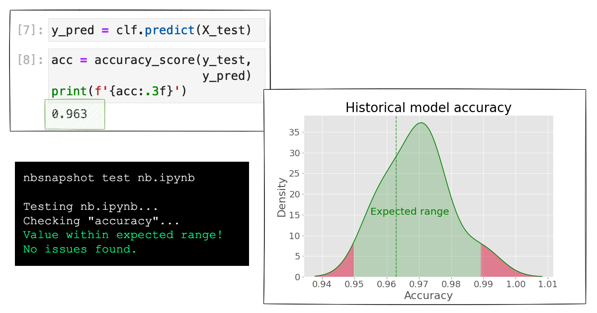
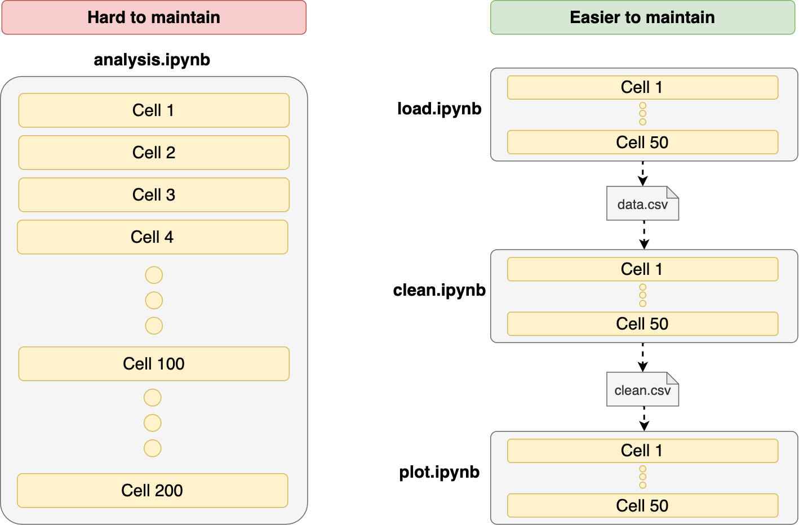
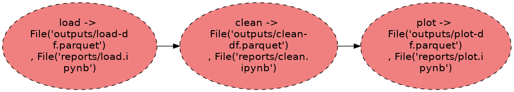

## ¿Jupyter Notebooks en producción? ¿Es ello posible?
## **Rodolfo Ferro**
#### Developer Advocate @ Ploomber <br> (Twitter/Instagram: [@rodo_ferro](https://twitter.com/rodo_ferro))


---

# ¿Es ello posible? [^1] [^2]


[^1]: Fuente: [Unsplash](https://unsplash.com/photos/YTUZcmmf1eU)

[^2]: Prueba: [Evidation Health (ploomber.io/blog/evidation)](https://ploomber.io/blog/evidation/)

---

## Trabajar con datos es un proceso **robusto** [^3]



[^3]: Fuente: [The Data Science Process](https://towardsdatascience.com/the-data-science-process-a19eb7ebc41b)

---

# **Jupyter:** un **formato** y una **plataforma**

```json
{
  "metadata" : {
    "kernel_info": {
        "name" : "name of the kernel"
    },
    "language_info": {
        "name" : "programming language",
        "version": "version of the language",
    }
  },
  "nbformat": 4,
  "nbformat_minor": 0,
  "cells" : [
  ],
}
```

#### Formato: [nbformat](https://nbformat.readthedocs.io/en/latest/format_description.html)




---

# **Truco:** ¡Cambiar el formato! [^4]

[.column]

1. Mejor integracion con `git`
2. Mejor interoperabilidad con otros ambientes de desarollo (VSCode, Spyder, PyCharm)


[.column]


```python
# data-cleaning.py
import pandas as pd

# %%
# one cell
df = pd.read_csv('my-data.csv')

# %%
# another cell
df['new-column'] = df['column'] + 1
```

[^4]: Paquete: [jupytext](https://github.com/mwouts/jupytext)

---

# **Parte I:** Cuadernos limpios 🧼 [^5]

[^5]: Lectura recomendada: [ploomber.io/blog/clean-nbs](https://ploomber.io/blog/clean-nbs/) (On Writing Clean Notebooks)

---

# Los **cuadernos limpios** son cuadernos cortos




^
1. Fáciles de entender
2. Re-utilizables
3. Fácil de organizar

  
---

# Los **cuadernos limpios** tienen operaciones <br>sin efectos laterales

[.column]

### Efecto lateral: **¡evitar!** ⚠️

```python
import pandas as pd

def add_one(df):
    df['zeros'] = df['zeros'] + 1

df = pd.DataFrame({'zeros': [0, 0, 0]})

# more code...

# a few dozen cells below...
add_one(df)

df
#    zeros
# 0      1
# 1      1
# 2      1
```

[.column]

### ¡Sin efectos! ✅

```python
def add_one(df):
    # copying the data frame!
    another = df.copy()
    another['zeros'] = another['zeros'] + 1
    return another

df = pd.DataFrame({'zeros': [0, 0, 0]})

ones = add_one(df)

df
#    zeros
# 0      0
# 1      0
# 2      0
```

---

# Los **cuadernos limpios** declaran <br>dependencias 🔒

[.column]

1. Actualizaciones de paquetes pueden romper tu proyecto
2. Hará más difícil correr el cuaderno en el futuro

```sh
# requirements.lock.txt
package-a==1.1
package-b==2.4
...
package-z==0.4
```

[.column]

Después de instalar las dependencies:

```sh
pip freeze > requirements.lock.txt
```

Para volver a crear el ambiente:

```sh
pip install -r requirements.lock.txt
```

---

# Los **cuadernos limpios** siguen estándares [^6]

[.column]

### Antes 👀



#### Comando: `soorgeon clean nb.ipynb`

[.column]

### Después 🧼



[^6]: Paquete [Soorgeon](https://github.com/ploomber/soorgeon) (Ploomber)

---

# Los **cuadernos limpios** separan <br>la **lógica** de la **narrativa** 📊


[.column]

1. **Lógica:** funciones, clases
2. **Narrativa:** gráficas, transformaciones de datos

> Define la lógica en un archivo:

```python
# transformations.py
def add_one(series):
    return series + 1
```

[.column]



---

# **Parte II:** Probando cuadernos (_testing_) 🧪 [^7]

[^7]: Lectura recomendada: [ploomber.io/blog/ci-for-ds](https://ploomber.io/blog/ci-for-ds/) y [ploomber.io/blog/ml-testing-i](https://ploomber.io/blog/ml-testing-i/)

---

# **Probando cuadernos:** Salidas de las celdas [^8]



[^8]: Paquete: [nbsnapshot](https://github.com/ploomber/nbsnapshot) (por Ploomber)

---

# **Probando cuadernos:** Archivos de salida [^9]

* **Ejemplo:** Pruebas de calidad de datos

```python
# assume your notebook produces df
def check_data_quality(df):
    # no nas
    assert df['column'].isna().sum() == 0
    # no negative numbers
    assert (df['column'] < 0).sum() == 0
```

[^9]: Paquete: [Ploomber](https://github.com/ploomber/ploomber)

---

# **Probando cuadernos:** Definiciones

[.column]

### Narrativa y lógica separada [^10]

```python
from transformations import add_one

def test_add_one():
    assert add_one(1, 2) == 3
```

[.column]

### Lógica embebida [^11]

```python
from testbook import testbook


@testbook('path/to/nb.ipynb')
def test_func(tb):
   add_one = tb.get("add_one")

   assert add_one(1, 2) == 3
```


[^10]: Paquete: [pytest](https://github.com/pytest-dev/pytest)

[^11]: Paquete: [testbook](https://github.com/nteract/testbook)

---

# **Parte III:** Construyendo *pipelines* de datos 🛠 [^12]

[^12]: Lectura recomendada: [ploomber.io/blog/clean-pipelines](https://ploomber.io/blog/clean-pipelines)

---

## Trabajar con datos es un proceso **robusto** [^13]


[^13]: Fuente: [The Data Science Process](https://towardsdatascience.com/the-data-science-process-a19eb7ebc41b)

---

#### Construyendo *pipelines* de datos [^14]




[^14]: Construyendo pipelines: [Ploomber](https://github.com/ploomber/ploomber). Convertir cuadernos existentes: [Soorgeon](https://github.com/ploomber/soorgeon) (por Ploomber)

---

### Construyendo *pipelines* de datos

[.column]


```yaml
# pipeline.yaml
tasks:
    - source: tasks/load.py
      product:
          df: outputs/load-df.parquet
          nb: reports/load.ipynb

    - source: tasks/clean.py
      product:
          df: outputs/clean-df.parquet
          nb: reports/clean.ipynb

    - source: tasks/plot.py
      product:
          df: outputs/plot-df.parquet
          nb: reports/plot.ipynb
```

[.column]

#### El archivo `pipeline.yaml` es utilizado para construir tus pipelines[^15]:



#### Con el CLI de Ploomber:

```sh
ploomber scaffold
ploomber plot --include-products
ploomber build 
```


[^15]: Lectura sugerida: [Tu primer _pipeline_ con Python](https://docs.ploomber.io/en/latest/get-started/first-pipeline.html)

---

# **Recursos**

[.column]

- Curso gratuito: [notebooks.academy](https://notebooks.academy)
- Presentación (con ligas): [rodolfoferro.xyz/assets/talks/calzada-code-ploomber.pdf](https://rodolfoferro.xyz/assets/talks/calzada-code-ploomber.pdf)
- Comunidad: [ploomber.io/community](https://ploomber.io/community)

[.column]


---
# ¡Gracias! 🎉

## Contacto: [rodo@ploomber.io](mailto:rodo@ploomber.io)

#### Redes: [@ploomber](https://twitter.com/ploomber)<br>(Síguenos, publicamos memes los viernes.)

